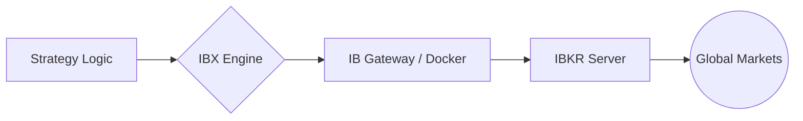

# IBX (Interactive Brokers Execution Engine)

[](https://opensource.org/licenses/Apache-2.0)
[](https://www.python.org/downloads/)
[](#)

**IBX** 是一个专为盈透证券（Interactive Brokers）打造的轻量级程序化交易执行引擎。它通过 **IB Gateway** 实现策略指令的自动化落地，旨在为开发者提供一个安全、稳定且易于扩展的交易底座。

---

## 🌟 核心特性

- **跨平台适配**：针对 macOS 本地开发、Synology NAS 长期运行以及 AWS 云端部署进行了优化。
- **安全隔离**：严格遵循网络安全规范，通过环境变量（`.env`）管理敏感凭据，确保账号安全。
- **异步驱动**：基于 `ib_insync` 构建，支持异步非阻塞的 API 调用，提升高频/多路交易的响应速度。
- **模块化架构**：将交易策略逻辑与底层执行逻辑解耦，支持快速接入自定义算法。

---

## 🏗 项目架构




## ✅ 网关健康检查

启动网关后，可用以下命令快速验证网关是否正常：

```bash
make check
```

该检查会执行两步：

- TCP 连通性检查（默认按 `conf/app.toml` 的 `ib_gateway.trading_mode` 选择端口：paper=`4002`，live=`4001`）
- IB API 最小握手检查（默认同上）

如果临时覆盖模式，可用：

```bash
make check-paper
# 或
make check-live
```

也可以直接运行脚本并自定义参数：

```bash
python3 scripts/check_ib_gateway.py --host 127.0.0.1 --ports 4002,4001 --api-port 4002
```

如果希望同时探测 paper/live 两个端口，可显式传：

```bash
python3 scripts/check_ib_gateway.py --ports 4002,4001
```

如果只想看端口是否打开（跳过 API 握手）：

```bash
python3 scripts/check_ib_gateway.py --skip-api
```

## 🔧 SSH Tunnel 常见问题（本机连 NAS 上的 IB Gateway）

当 NAS 本机检查正常，但本机通过 SSH 隧道访问失败时，可能看到这种现象：

- `tcp:4002` 显示 `PASS`
- `api:4002` 显示 `Connection reset by peer`
- SSH `-v` 日志出现 `open failed: administratively prohibited`

这通常不是 IB Gateway 本身故障，而是 **NAS 的 SSH 服务端策略禁止端口转发（direct-tcpip）**。

建议排查与修复：

1. 本机前台启动隧道并看调试日志：
```bash
ssh -v -N -L 127.0.0.1:4002:127.0.0.1:4002 <user>@<nas_ip>
```
2. 若出现 `administratively prohibited`，在 NAS 检查 SSH 配置：
```bash
sudo grep -nE 'AllowTcpForwarding|PermitOpen|Match|ForceCommand' /etc/ssh/sshd_config /etc/ssh/sshd_config.d/* 2>/dev/null
```
3. 确保配置允许转发（全局或对应 `Match User` 内）：
```conf
AllowTcpForwarding yes
PermitOpen any
```
4. 重启 NAS 的 SSH 服务后重试隧道。

隧道建立成功后（日志应包含 `Local forwarding listening on 127.0.0.1 port 4002`），本机连接参数使用：

- `IB_HOST=127.0.0.1`
- `IB_PORT=4002`

默认情况下，这些参数也可在 `conf/app.toml` 的 `[ib_gateway]` 段统一配置。

## 📊 查看当前资产组合

在网关正常可用后，执行：

```bash
make portfolio
```

默认按 `conf/app.toml` 的 `ib_gateway.trading_mode` 选择连接端口。

或直接运行：

```bash
python3 scripts/list_portfolio.py --host 127.0.0.1 --port 4002 --client-id 99
```

常用参数：

- `--json`：以 JSON 输出，便于接入自动化流程
- `--account <账户号>`：只查看指定账户持仓
- `--port 4001`：查看实盘账户（`TRADING_MODE=live`）

## 🧪 获取最近一条 K 线（命令行测试）

根据 `code + bar size` 获取最近一条已完成 bar：

```bash
python3 scripts/get_latest_bar.py --code AAPL --bar-size "1 min" --market US_STOCK --json
```

COMEX 期货示例：

```bash
python3 scripts/get_latest_bar.py --code GC --bar-size "1 hour" --market COMEX_FUTURES --json
```

可选参数：
- `--all-hours`：包含盘前盘后/非 RTH 时段（默认仅 RTH）
- `--contract-month YYYYMM`：期货指定合约月
- `--lookback-bars`：回看 bar 数（默认 `30`）

## 🖥 静态控制台 UI（Bootstrap 5）

仓库已提供静态控制台原型：

- `ui/index.html`
- `ui/app.js`
- `ui/styles.css`
- `ui/strategies.html`
- `ui/strategy-detail.html`
- `ui/strategy-editor.html`（兼容跳转）
- `ui/strategy-editor-basic.html`
- `ui/strategy-editor-conditions.html`
- `ui/strategy-editor-actions.html`
- `ui/events.html`
- `ui/positions.html`
- `ui/trade-instructions.html`

特点：
- 采用 Bootstrap 5（CDN，无需构建）
- 多页面单职责，顶部菜单切换功能（移动端可折叠）
- 策略编辑拆分为“基本信息/触发条件/后续动作”三段式流程
- 覆盖策略列表、策略详情、运行事件、持仓情况、交易指令
- 用于先确定交互和字段，再对接 API

---

## 🚀 FastAPI API 骨架

仓库已补充后端 API 骨架（`app/`）：

- `app/main.py`：FastAPI 应用入口
- `app/api.py`：`/v1` 路由定义
- `app/models.py`：Pydantic 请求/响应模型
- `app/store.py`：内存态示例存储（便于前后端联调）
- `requirements.txt`：后端依赖

### 启动方式

```bash
conda activate ibx
cd /Users/jason/Documents/GitHub/ibx
pip install -r requirements.txt
make init-db
make seed-sample
python -m uvicorn app.main:app --reload --host 127.0.0.1 --port 8000
```

`make init-db` 会执行 `app/sql/schema_v1.sql`，初始化 SQLite 表结构（默认路径 `data/ibx.sqlite3`，可通过 `IBX_DB_PATH` 覆盖）。

### 统一配置文件（`conf/app.toml`）

应用运行时配置集中在 `conf/app.toml`：

- `[ib_gateway]`：网关 `host`、`paper_port/live_port`、`client_id`、`timeout_seconds` 等
- `[runtime]`：`data_dir`、`db_path`、日志路径、行情缓存路径等
- `[worker]`：执行引擎开关、扫描间隔、线程数、队列长度等

条件判定规则使用独立配置文件 `conf/condition_rules.json`（不放在 `app.toml`）：
- `trigger_mode_profiles`：按 `trigger_mode + evaluation_window` 定义 `base_bar`、`confirm_consecutive`、`confirm_ratio`、`include_partial_bar`、`missing_data_policy`
- `metric_trigger_operator_rules.allowed_windows`：定义各 `metric` 可用窗口（价格相关与 `SPREAD`：`1m/5m/30m/1h`；比值类：`1h/2h/4h/1d/2d`）
- `metric_trigger_operator_rules.allowed_rules`：定义各 `metric` 可用 `trigger_mode + operator` 组合（`SPREAD` 当前仅允许 confirm 触发）

路径优先级：

1. 环境变量（如 `IBX_DATA_DIR`、`IBX_DB_PATH`）
2. `conf/app.toml`
3. 代码内缺省值（项目内 `data/`）

运行时数据目录约定：
- 数据库：`data/ibx.sqlite3`
- 应用日志：`data/logs/ibx.log`
- 行情日志：`data/logs/market_data.log`
- 行情缓存：`data/market_cache.sqlite3`

可选覆盖：
- `IBX_APP_CONFIG`：覆盖应用配置文件路径（默认 `conf/app.toml`）
- `IBX_DATA_DIR`：统一修改运行时根目录（默认项目内 `data/`）
- `IBX_DB_PATH`：仅覆盖数据库文件路径
- `IBX_LOG_PATH`：仅覆盖日志文件路径
- `IBX_MARKET_DATA_LOG_PATH`：仅覆盖行情日志文件路径
- `IBX_MARKET_CACHE_DB_PATH`：仅覆盖行情缓存数据库路径

样本数据：
- `make seed-sample` 会先清空运行时业务数据，再灌入干净的 `SMP-*` 样本（策略、事件、交易、持仓与组合快照）。
- 如需只刷新 `SMP-*` 而保留其它数据，可执行：`python3 scripts/seed_sample_data.py --keep-non-sample`

### 已实现的 `/v1` 路由骨架

- `POST /v1/strategies`
- `GET /v1/strategies`
- `GET /v1/strategies/{id}`
- `PATCH /v1/strategies/{id}/basic`
- `PUT /v1/strategies/{id}/conditions`
- `PUT /v1/strategies/{id}/actions`
- `POST /v1/strategies/{id}/activate`
- `POST /v1/strategies/{id}/pause`
- `POST /v1/strategies/{id}/resume`
- `POST /v1/strategies/{id}/cancel`
- `GET /v1/strategies/{id}/events`
- `GET /v1/events`
- `GET /v1/trade-instructions/active`
- `GET /v1/trade-logs`
- `GET /v1/portfolio-summary`
- `GET /v1/positions`
- `GET /v1/healthz`

### 策略字段与状态（当前实现）

- 策略基础标的字段使用 `market`（例如 `US_STOCK`、`COMEX_FUTURES`）。
- `market` 到 `sec_type/exchange/currency` 的映射由 `conf/markets.json` 提供。
- `symbols[*]` 结构为：`code`、`trade_type`、`contract_id`（可空）。
- 激活流程主状态：`PENDING_ACTIVATION -> VERIFYING -> ACTIVE`，校验失败转 `VERIFY_FAILED`。
- 配置变更（basic/conditions/actions）后，策略状态会重置回 `PENDING_ACTIVATION`。

### 行情历史数据模块（当前实现）

实现文件：`app/market_data.py`

主接口：
- `SQLiteMarketDataCache.get_historical_bars(request)`
- 请求结构：`HistoricalBarsRequest`

请求参数：
- `contract`
- `start_time`
- `end_time`
- `bar_size`
- `what_to_show`（默认 `TRADES`）
- `use_rth`（默认 `true`）
- `include_partial_bar`（默认 `false`）
- `max_bars`（可选）
- `page_size`（可选，默认 `500`）

行为说明：
- 全部时间统一按 `UTC` 处理与返回。
- 使用 SQLite 本地缓存，并按“缓存覆盖区间”计算缺口，只请求未缓存分段。
- 支持按 `page_size` 拆分请求区间，避免单次拉取过大。
- 返回 `bars + meta`，其中 `meta` 包含缓存命中率、分段拉取明细、覆盖区间等信息。

### 条件评估器接口（当前实现）

实现文件：`app/evaluator.py`

- `ConditionEvaluator(condition)`：
- 构造时绑定单条条件。
- `ConditionEvaluator.prepare()`：
- 解析 `trigger_mode + evaluation_window` 策略配置。
- 返回 `ConditionDataRequirement`，并在实例内缓存 `PreparedCondition` 供后续计算使用。
- `ConditionEvaluator.evaluate(evaluation_input)`：
- `evaluation_input.values_by_contract`：按 `contract_id` 传入数值序列。
- `evaluation_input.state_values`：传入运行时状态值（如 `since_activation_high/low`）。
- 仅做单条件比较，返回 `TRUE/FALSE/WAITING`。
- 返回结构：`state`、`observed_value`、`reason`。
