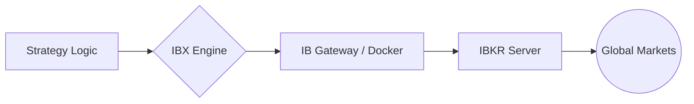

# IBX (Interactive Brokers Execution Engine)

[](https://opensource.org/licenses/Apache-2.0)
[](https://www.python.org/downloads/)
[](#)

**IBX** 是一个专为盈透证券（Interactive Brokers）打造的轻量级程序化交易执行引擎。它通过 **IB Gateway** 实现策略指令的自动化落地，旨在为开发者提供一个安全、稳定且易于扩展的交易底座。

---

## 🌟 核心特性

- **跨平台适配**：针对 macOS 本地开发、Synology NAS 长期运行以及 AWS 云端部署进行了优化。
- **安全隔离**：严格遵循网络安全规范，通过环境变量（`.env`）管理敏感凭据，确保账号安全。
- **异步驱动**：基于 `ib_insync` 构建，支持异步非阻塞的 API 调用，提升高频/多路交易的响应速度。
- **模块化架构**：将交易策略逻辑与底层执行逻辑解耦，支持快速接入自定义算法。

---

## 🏗 项目架构




## ✅ 网关健康检查

启动网关后，可用以下命令快速验证网关是否正常：

```bash
make check
```

该检查会执行两步：

- TCP 连通性检查（默认端口 `4002,4001`）
- IB API 最小握手检查（默认端口 `4002`）

也可以直接运行脚本并自定义参数：

```bash
python3 scripts/check_ib_gateway.py --host 127.0.0.1 --ports 4002,4001 --api-port 4002
```

如果只想看端口是否打开（跳过 API 握手）：

```bash
python3 scripts/check_ib_gateway.py --skip-api
```

## 🔧 SSH Tunnel 常见问题（本机连 NAS 上的 IB Gateway）

当 NAS 本机检查正常，但本机通过 SSH 隧道访问失败时，可能看到这种现象：

- `tcp:4002` 显示 `PASS`
- `api:4002` 显示 `Connection reset by peer`
- SSH `-v` 日志出现 `open failed: administratively prohibited`

这通常不是 IB Gateway 本身故障，而是 **NAS 的 SSH 服务端策略禁止端口转发（direct-tcpip）**。

建议排查与修复：

1. 本机前台启动隧道并看调试日志：
```bash
ssh -v -N -L 127.0.0.1:4002:127.0.0.1:4002 <user>@<nas_ip>
```
2. 若出现 `administratively prohibited`，在 NAS 检查 SSH 配置：
```bash
sudo grep -nE 'AllowTcpForwarding|PermitOpen|Match|ForceCommand' /etc/ssh/sshd_config /etc/ssh/sshd_config.d/* 2>/dev/null
```
3. 确保配置允许转发（全局或对应 `Match User` 内）：
```conf
AllowTcpForwarding yes
PermitOpen any
```
4. 重启 NAS 的 SSH 服务后重试隧道。

隧道建立成功后（日志应包含 `Local forwarding listening on 127.0.0.1 port 4002`），本机连接参数使用：

- `IB_HOST=127.0.0.1`
- `IB_PORT=4002`

## 📊 查看当前资产组合

在网关正常可用后，执行：

```bash
make portfolio
```

或直接运行：

```bash
python3 scripts/list_portfolio.py --host 127.0.0.1 --port 4002 --client-id 99
```

常用参数：

- `--json`：以 JSON 输出，便于接入自动化流程
- `--account <账户号>`：只查看指定账户持仓
- `--port 4001`：查看实盘账户（`TRADING_MODE=live`）

## 🖥 静态控制台 UI（Bootstrap 5）

仓库已提供静态控制台原型：

- `ui/index.html`
- `ui/app.js`
- `ui/styles.css`
- `ui/strategies.html`
- `ui/strategy-detail.html`
- `ui/strategy-editor.html`（兼容跳转）
- `ui/strategy-editor-basic.html`
- `ui/strategy-editor-conditions.html`
- `ui/strategy-editor-actions.html`
- `ui/events.html`
- `ui/verification.html`

特点：
- 采用 Bootstrap 5（CDN，无需构建）
- 多页面单职责，顶部菜单切换功能（移动端可折叠）
- 策略编辑拆分为“基本信息/触发条件/后续动作”三段式流程
- 覆盖策略列表、策略详情、运行事件、交易日志
- 用于先确定交互和字段，再对接 API
