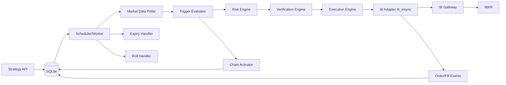

# IBX 设计文档（需求引用版）

本文档以 `/Users/jason/Documents/GitHub/ibx/requirements.md` 为唯一需求来源。
所有设计项均引用对应需求编号，避免需求与设计漂移。

---

## 1. 设计目标

- 为个人单账户场景提供可落地的策略执行引擎（R2.1, R2.3）。
- 覆盖条件监测、链式触发、下单执行、展期执行、核验拒单全流程（R4.3, R4.4, R4.8, R4.10, R4.11）。
- 保持单机轻量实现，优先稳定与可追溯（R5.2, R5.4）。

---

## 2. 需求引用矩阵

- `R2.1` 范围与能力：单账户、条件类型、订单类型、到期、期货、链式触发。
- `R4.1` 策略创建字段与输入约束。
- `R4.2` 查询与控制（取消/激活/暂停/恢复）。
- `R4.3` 监测间隔配置（20~300 秒）。
- `R4.4` 触发到下单流程。
- `R4.5` 到期中止。
- `R4.6` 幂等防重。
- `R4.7` 重启恢复。
- `R4.8` 期货展期。
- `R4.10` 链式触发与下游激活。
- `R4.11` 发单前核验机制。
- `R4.12` 交易动作结构。
- `R4.14` 全局条件配置。
- `R5.x` 安全、可靠性、可观测、可维护。
- `R6` USD-only、单账户、交割约束。
- `R7` 策略状态定义。
- `R8` DoD。

---

## 3. 总体架构



设计说明：
- 单机部署：API + Worker 同进程或双进程，避免引入 Redis/Celery（R5.4）。
- SQLite 持久化，满足单用户单账户场景（R2.1, R6）。
- 发单路径固定为：`Risk -> Verification -> Execution`（R4.4, R4.11）。

---

## 4. 核心模块

### 4.1 Strategy API
- 创建与查询：
  - `POST /v1/strategies`：创建策略（R4.1）。
  - `GET /v1/strategies` / `GET /v1/strategies/{id}`：查询（R4.2, R4.13）。
- 三段编辑（对应 UI 三页，R4.13）：
  - `PATCH /v1/strategies/{id}/basic`：更新基本信息。
  - `PUT /v1/strategies/{id}/conditions`：更新触发条件列表与 `condition_logic`。
  - `PUT /v1/strategies/{id}/actions`：更新 `trade_action_json` 与 `next_strategy_id`。
- 控制操作：
  - `POST /v1/strategies/{id}/cancel`：取消（R4.2）。
  - `POST /v1/strategies/{id}/activate`：手动激活（仅 `upstream_only_activation=false` 时允许，R4.2, R4.10）。
  - `POST /v1/strategies/{id}/pause`：暂停（仅 `ACTIVE` 时允许，R4.2）。
  - `POST /v1/strategies/{id}/resume`：恢复（仅 `PAUSED` 时允许，R4.2）。
- 日志与辅助查询：
  - `GET /v1/strategies/{id}/events`：单策略事件日志。
  - `GET /v1/events`：全局运行事件。
  - `GET /v1/trade-instructions/active`：当前有效交易指令（未终态）。
  - `GET /v1/trade-logs`：交易指令日志（核验 + 执行，含 `trade_id`）。
  - `GET /v1/portfolio-summary`：账户持仓总览。
  - `GET /v1/positions`：持仓明细（支持 `sec_type/symbol` 过滤；编辑页可按产品精确查询持仓提示）。

### 4.2 Scheduler/Worker
- 周期拉取 `ACTIVE` 策略（含已激活上下文）评估触发（R4.3, R4.10）。
- 执行到期中止（R4.5）。
- 执行期货展期检查（R4.8）。
- `PAUSED` 策略不参与触发评估（R4.2, R4.3）。

### 4.3 Trigger Evaluator
统一按条件列表评估（R4.1）：
- 顶层：`condition_logic`（`AND` / `OR`）
- 条件项：`condition_type`（`SINGLE_PRODUCT` / `PAIR_PRODUCTS`）
- 条件项字段：`condition_id`、`metric`、`trigger_mode`、`evaluation_window`、`window_price_basis`、`operator`、`value` 以及产品字段
- `value` 语义按 `metric` 解释：`PRICE/SPREAD` 为 USD，`DRAWDOWN_PCT/RALLY_PCT/LIQUIDITY_RATIO` 为比例
- 条件文本渲染：生成 `condition_nl`（统一文案模板，供详情/日志直接展示）

条件原子支持（R4.1）：
- `SINGLE_PRODUCT`：`PRICE` / `DRAWDOWN_PCT` / `RALLY_PCT`
- `PAIR_PRODUCTS`：`LIQUIDITY_RATIO` / `SPREAD`

触发语义：
- 本系统固定 `ONCE`，不提供 `on_trigger` 配置（R4.12）。
- `evaluation_window` 为滚动窗口，`MONITOR_INTERVAL_SECONDS` 为调度频率，二者独立（R4.3, R4.14）。
- `evaluation_window` 最小值为 `1m`（R4.14）。
- `window_price_basis` 用于指定评估窗口取值口径（`CLOSE/HIGH/LOW/AVG`，默认 `CLOSE`）。

### 4.4 Chain Activator
- `next_strategy_id` 有值时激活下游策略（R4.1, R4.10）。
- 下游接收上游上下文（如 `anchor_price`）（R4.10）。
- 记录下游 `logical_activated_at=upstream_triggered_at`，与实际 `activated_at` 区分（R4.10）。
- 写入激活行情快照（如 `last/high/low`）并在延迟激活时做区间补偿（R4.10）。
- 同一触发事件对同一下游仅激活一次（R4.10）。
- 启动时做 DAG 校验，拒绝环路（R4.10）。
- 若下游 `upstream_only_activation=true`，仅允许 Chain Activator 激活（R4.10）。

### 4.5 Risk Engine
- 账户、产品币种、交易时段、展期交割风险等风控（R4.4, R4.8, R6）。
- 非 USD 产品直接拒绝（R4.4, R6）。

### 4.6 Verification Engine
可配置核验规则（R4.11）：
- `max_notional_usd`
- `allowed_order_types`

要求：
- 核验失败不发单。
- 结构化记录规则 ID / 版本 / 原因（R4.11, R5.2）。

### 4.7 Execution Engine + IB Adapter
- 把 `trade_action` 转成订单请求并发给 IB（R4.4, R4.12）。
- 统一按数量下单（`quantity`），不做名义金额换算（R4.4）。
- 统一按 `TIF=DAY` 发单；`allow_overnight=true` 时附带隔夜时段成交标记（R4.12）。
- 订阅并回写订单/成交状态（R4.4）。

---

## 5. 数据模型（最小实现）

### 5.1 `strategies`
关键字段（与 R4.1 对齐）：
- `id`, `idempotency_key`, `description`, `trade_type`, `symbols`, `currency`
- `conditions_json`, `condition_logic`
- `trade_action_json`, `next_strategy_id`, `next_strategy_note`, `anchor_price`
- `upstream_only_activation`, `activated_at`, `logical_activated_at`, `expire_in_seconds`
- `expire_at`, `status`, `created_at`, `updated_at`

`symbols[*]` 结构：
- `code`（产品代码）
- `trade_type`（`buy` / `sell` / `open` / `close` / `ref`，`ref` 仅参考不下单）

组合约束（与 R4.1 对齐）：
- `trade_type in {buy,sell,switch}`：`symbols[*].trade_type` 仅允许 `buy/sell/ref`；
- `trade_type in {open,close,spread}`：`symbols[*].trade_type` 仅允许 `open/close/ref`。

### 5.6 `trade_action_json` 结构
- `action_type`：`STOCK_TRADE` / `FUT_POSITION` / `FUT_ROLL`
- `quantity`：统一数量
- `tif`：固定 `DAY`
- `allow_overnight`：`true/false`（默认 `false`）
- `cancel_on_expiry`：`true/false`（默认 `false`）

`action_type=STOCK_TRADE`：
- `symbol`
- `side`：`BUY` / `SELL`
- `order_type`：`MKT` / `LMT`
- `limit_price`：`order_type=LMT` 时必填

`action_type=FUT_POSITION`：
- `symbol`
- `contract`：可选
- `position_effect`：`OPEN` / `CLOSE`
- `side`：`BUY` / `SELL`
- `order_type`：`MKT` / `LMT`
- `limit_price`：`order_type=LMT` 时必填

`action_type=FUT_ROLL`：
- `symbol`
- `close_contract`, `open_contract`
- `close_order_type` / `open_order_type`：`MKT` / `LMT`
- `close_limit_price` / `open_limit_price`：对应腿为 `LMT` 时必填
- `max_leg_slippage_usd`：可选

说明：
- `trade_action_json` 可为空，表示该策略只负责激活下游策略（R4.12）。
- `trade_type in {buy,sell,switch}` 仅允许 `action_type=STOCK_TRADE`；`trade_type in {open,close,spread}` 仅允许 `FUT_POSITION/FUT_ROLL`（R4.12）。

### 5.7 `conditions_json` 条件项结构
- `condition_id`
- `condition_nl`（系统生成，只读）
- `condition_type`
- `metric`
- `trigger_mode`
- `evaluation_window`
- `window_price_basis`
- `operator`
- `value`
- `product` 或 `product_a/product_b`
- `price_reference`（比例类指标，按 `metric` 联动：`DRAWDOWN_PCT->HIGHEST_SINCE_ACTIVATION`，`RALLY_PCT->LOWEST_SINCE_ACTIVATION`）

### 5.2 `strategy_activations`
- `id`, `from_strategy_id`, `to_strategy_id`, `trigger_event_id`, `effective_activated_at`, `market_snapshot_json`, `context_json`, `created_at`
- 唯一约束：`(trigger_event_id, to_strategy_id)`（R4.10）

### 5.3 `orders`
- `id`, `strategy_id`, `ib_order_id`, `status`, `qty`, `avg_fill_price`, `filled_qty`, `error_message`, `created_at`, `updated_at`

### 5.4 `verification_events`
- `id`, `strategy_id`, `rule_id`, `rule_version`, `passed`, `reason`, `order_snapshot_json`, `created_at`

### 5.5 `strategy_runs`
- `id`, `strategy_id`, `evaluated_at`, `condition_met`, `decision_reason`, `metrics_json`

### 5.8 `condition_states`（读模型，可选）
- `id`, `strategy_id`, `condition_id`, `state`, `last_value`, `last_evaluated_at`, `updated_at`
- `state`：`TRUE` / `FALSE` / `WAITING` / `NOT_EVALUATED`
- 用于详情页“条件是否满足”与“条件组状态”快速读取（R4.13）

---

## 6. 状态机

策略状态沿用需求定义（R7）：
- `PENDING_ACTIVATION`
- `ACTIVE`
- `PAUSED`
- `TRIGGERED`
- `ORDER_SUBMITTED`
- `FILLED`
- `EXPIRED`
- `CANCELLED`
- `FAILED`

状态迁移（最小）：
- `PENDING_ACTIVATION -> ACTIVE`（手动激活或上游激活）
- `ACTIVE -> PAUSED -> ACTIVE`
- `ACTIVE -> TRIGGERED -> ORDER_SUBMITTED -> FILLED`
- `PENDING_ACTIVATION/ACTIVE/PAUSED -> CANCELLED`
- `ACTIVE/PAUSED -> EXPIRED`
- `ORDER_SUBMITTED` 到期后不转 `EXPIRED`，走撤单或继续跟踪
- 任意执行阶段异常 -> `FAILED`

---

## 7. 关键流程

### 7.1 创建策略
1. 参数校验与字段归一化（R4.1）。
2. `len(conditions)` 校验 <= `MAX_CONDITIONS_PER_STRATEGY`（R4.14）。
3. `expire_at/expire_in_seconds` 校验 <= 1 周；若为相对时间，仅在激活时计算绝对到期（R4.1, R4.5）。
4. 若提交了条件，则为每条条件生成 `condition_nl` 并持久化（R4.13）。
5. 初始状态写入 `PENDING_ACTIVATION`（R7）。
   - 即使尚未设置 `conditions_json`/`trade_action_json`，状态也保持 `PENDING_ACTIVATION`。
6. 幂等检查：`idempotency_key` 冲突返回已有记录（R4.6）。

### 7.2 激活策略
1. 手动激活请求到达时，若 `upstream_only_activation=true` 则拒绝（R4.2, R4.10）。
2. 激活前完整性校验：
- `conditions_json` 至少 1 条；
- `trade_action_json` 与 `next_strategy_id` 至少存在一个（避免空动作激活）。
3. 激活时写入 `activated_at`。
4. 若使用 `expire_in_seconds`，计算 `expire_at = activated_at + expire_in_seconds`（R4.1, R4.5）。
5. 状态转为 `ACTIVE`。

### 7.2A 暂停与恢复策略
1. `pause`：仅 `ACTIVE` 允许，状态转 `PAUSED`（R4.2）。
2. `resume`：仅 `PAUSED` 允许，状态转 `ACTIVE`（R4.2）。
3. 暂停不影响已提交订单回报跟踪（`ORDER_SUBMITTED` 不可 pause/resume）。

### 7.2B 三段编辑保存
1. 编辑门控：`PATCH basic`、`PUT conditions`、`PUT actions` 仅 `PENDING_ACTIVATION/PAUSED` 允许（R4.13）。
2. 若状态不允许编辑，返回 `409`，附 `editable=false` 与原因文案。
3. `PUT conditions`：
- 校验 `len(conditions) <= MAX_CONDITIONS_PER_STRATEGY`；
- 自动生成/更新 `condition_nl`；
- 若 `condition_id` 缺失则服务端生成稳定 ID。
4. `PUT actions`：
- 校验 `trade_type` 与 `action_type` 匹配；
- `order_type=LMT` 时对应限价必填；
- 同时支持“仅交易”“仅激活下游”“交易+激活下游”。
5. `PATCH basic`：
- 支持更新 `description`、过期方式、`upstream_only_activation` 等；
- `expire_in_seconds` 相对时间仍以“激活时”计算绝对到期（R4.5）。

### 7.3 监测与触发
1. 每 `MONITOR_INTERVAL_SECONDS` 扫描策略（R4.3）。
2. 计算触发条件（R4.1）：
- 对 `price_reference=HIGHEST_SINCE_ACTIVATION/LOWEST_SINCE_ACTIVATION`，使用 `logical_activated_at` 作为统计起点。
3. 命中后执行 `Risk Engine` 与 `Verification Engine`（R4.4, R4.11）。
4. 通过则下单；失败则记 `FAILED` 并保留原因（R5.2）。

### 7.4 链式触发
1. 上游命中并执行动作。
2. 若 `next_strategy_id` 存在，写入 activation 事件并激活下游（R4.10）：
- `effective_activated_at = upstream_triggered_at`
- 记录 `market_snapshot_json`（至少 `last/high/low`）
3. 下游激活时：
- `logical_activated_at = effective_activated_at`
- `activated_at = now`
- 对 `[logical_activated_at, activated_at]` 进行行情补偿，初始化 `highest/lowest since activation`
4. 下游独立监测与执行（R4.10）。

### 7.5 到期中止
- 若策略尚未发单（`PENDING_ACTIVATION/ACTIVE/PAUSED/TRIGGERED`）且到期：转 `EXPIRED`（R4.5）。
- 若策略已发单（`ORDER_SUBMITTED`）且到期：
  - `cancel_on_expiry=true`：发起撤单，成功转 `CANCELLED`；
  - `cancel_on_expiry=false`：继续跟踪 IB 回报，直至 `FILLED/CANCELLED/FAILED`。
- `cancel_on_expiry` 缺省按 `false` 处理。
- `PAUSED` 状态下到期计时继续，不冻结 `expire_at`。

### 7.6 期货展期
1. 识别待切换/目标合约。
2. 满足条件后执行“先平后开”（R4.8）。
3. 展期只执行一次，失败告警并记录（R4.8, R5.3）。

### 7.7 重启恢复
- 启动恢复 `ACTIVE` 监测与 `PENDING_ACTIVATION/PAUSED` 原样状态。
- 对 `ORDER_SUBMITTED` 执行补偿查询并回写（R4.7）。

---

## 8. 配置设计

### 8.1 监测配置
- `MONITOR_INTERVAL_SECONDS`：`20~300`，默认 `60`（R4.3）。

### 8.4 条件配置
- `MAX_CONDITIONS_PER_STRATEGY`：默认建议 `5`（R4.14）。

### 8.2 交易模式
- `ENABLE_LIVE_TRADING`：默认 `false`（R5.1）。

### 8.3 核验配置
- `verification.max_notional_usd`
- `verification.allowed_order_types`

---

## 9. UI 对齐实现

本节对齐当前静态 UI 页面（`/Users/jason/Documents/GitHub/ibx/ui`），约束 API 输出字段与页面职责（对齐 R4.13）。

### 9.1 主菜单与入口
- 主菜单：`策略列表`、`运行事件`、`持仓情况`、`交易指令`
- `策略编辑` 不在主菜单，入口来自策略列表“新建策略”按钮

### 9.2 页面职责
1. 策略列表页（`strategies.html`）：
- 仅显示摘要字段：`id`、`status`、`description`、`updated_at`、`expire_at`
- 不返回 `conditions_json`、`trade_action_json` 明细到列表组件
- 返回 `capabilities`（如 `can_activate/can_cancel`）用于按钮可用性控制

2. 策略详情页（`strategy-detail.html`）：
- 已配置策略：返回完整结构 `conditions_json`、`trade_action_json`、`next_strategy_id`、`anchor_price`
- 仅完成基本信息的新策略：返回基础信息，`conditions_json` 与 `trade_action_json` 可为空
- 当条件/动作为空时，详情页对应区块显示表头单一入口按钮（文案“设置触发条件/设置后续动作”）与空态提示
- `conditions_json[*].condition_nl` 由后端返回，前端直接展示
- 基础信息区返回并展示策略控制能力：`cancel/pause/resume/activate` 的可用性
- 编辑门控：仅 `PENDING_ACTIVATION` / `PAUSED` 状态允许进入 `触发条件编辑` 与 `后续动作编辑`
- 其它状态返回 `editable=false`，前端禁用编辑入口并提示“ACTIVE 请先暂停”
- 返回条件运行态：
  - `trigger_group_status`（`NOT_CONFIGURED/MONITORING/TRIGGERED/EXPIRED`）
  - `conditions_runtime[*]`：`condition_id`、`state(TRUE/FALSE/WAITING/NOT_EVALUATED)`、`last_value`、`last_evaluated_at`
- 布局约束：
- `触发条件`在上，`后续动作`在下。
- `后续动作`合并展示 `next_strategy` 与 `trade_action`，不再拆分为两张卡片。
- `trade_action` 以可读字段展示，并在小区域标题处显示交易状态。
- `next_strategy` 返回对象投影：`id`、`description`、`status`（满足链式控制卡片展示）
- `trade_action` 返回交易运行态：`trade_status`、`trade_id`、`last_error`（用于标题状态与详情）
- `触发条件`与`后续动作`表头使用统一结构（标题/状态/编辑）。
- `后续动作`与`触发条件`均使用单一头部编辑按钮，按钮文案按配置状态动态切换。
- 返回该策略事件日志：`timestamp`、`event_type`、`detail`

3. 策略编辑（拆分三页）：
- 基本信息编辑页（`strategy-editor-basic.html`）：
- “新建策略”仅进入本页
- 保存后跳转 `strategy-detail.html`，初始 `conditions_json` 与 `trade_action_json` 为空

- 触发条件编辑页（`strategy-editor-conditions.html`）：
- 支持编辑条件项字段：`condition_id`、`trigger_mode`、`evaluation_window`
- 支持编辑 `window_price_basis`（收盘/最高/最低/平均，默认收盘价）
- `trigger_mode/operator` 通过“触发判定”联动控件编辑，且选项按 `metric` 动态收敛
- `condition_type=SINGLE_PRODUCT/PAIR_PRODUCTS` 切换时动态显示对应字段
- 单产品比例类条件使用“指标（含基准）”组合控件选择，`price_reference` 不单独暴露输入

- 后续动作编辑页（`strategy-editor-actions.html`）：
- 支持编辑 `trade_action_json` 与 `next_strategy_id`
- 支持按 `sec_type/symbol` 查询持仓提示（`GET /v1/positions`）

4. 运行事件页（`events.html`）：
- 返回全局事件流，字段与详情页事件日志一致
- 额外包含：`strategy_id`

5. 持仓情况页（`positions.html`）：
- 返回账户总览：`net_liquidation`、`available_funds`、`daily_pnl`、`updated_at`
- 返回持仓明细：`sec_type`、`symbol`、`position_qty`、`avg_price`、`last_price`、`market_value`、`unrealized_pnl`

6. 交易指令页（`trade-instructions.html`）：
- 返回“当前有效交易指令”（未终态）列表
- 返回核验 + 执行合并日志
- 有效指令关键字段：`updated_at`、`strategy_id`、`trade_id`、`instruction_summary`、`status`、`expire_at`
- 日志关键字段：`timestamp`、`strategy_id`、`trade_id`、`stage`、`result`、`detail`

### 9.3 API 投影建议
- `GET /v1/strategies`：列表摘要投影（避免大字段）
- `GET /v1/strategies/{id}`：详情全量结构
- `PATCH /v1/strategies/{id}/basic`：保存基本信息
- `PUT /v1/strategies/{id}/conditions`：保存触发条件
- `PUT /v1/strategies/{id}/actions`：保存后续动作
- `GET /v1/strategies/{id}/events`：单策略事件日志
- `GET /v1/events`：全局事件日志
- `GET /v1/trade-instructions/active`：有效交易指令列表
- `GET /v1/trade-logs`：交易日志（核验+执行，含 `trade_id`）
- `GET /v1/portfolio-summary`：持仓页总览
- `GET /v1/positions`：持仓页明细（支持 `sec_type/symbol` 过滤）；编辑页可按 `sec_type/symbol` 精确查询

### 9.4 API 契约（最小）
1. `GET /v1/strategies`（列表页）
- 返回数组项最小字段：
  - `id`、`status`、`description`、`updated_at`、`expire_at`
  - `capabilities.can_activate`、`capabilities.can_cancel`

2. `GET /v1/strategies/{id}`（详情页）
- 最小字段：
  - 基本信息：`id`、`description`、`trade_type`、`symbols`、`currency`、`upstream_only_activation`、`activated_at`、`expire_in_seconds`、`expire_at`、`status`
  - 编辑与操作能力：`editable`、`editable_reason`、`capabilities(can_activate/can_pause/can_resume/can_cancel)`、`capability_reasons`
  - `can_activate=false` 的典型原因：`upstream_only_activation=true`、条件未配置、后续动作未配置
  - 触发条件：`condition_logic`、`conditions_json[*]`（含 `condition_nl`）
  - 条件运行态：`trigger_group_status`、`conditions_runtime[*]`
  - 后续动作：`trade_action_json`、`trade_action_runtime(trade_status/trade_id/last_error)`、`next_strategy(id/description/status)`
  - 事件日志：`events[*]`（`timestamp`、`event_type`、`detail`）

3. `PATCH /v1/strategies/{id}/basic`
- 请求体：`description`、`upstream_only_activation`、`expire_mode`、`expire_in_seconds|expire_at`、`trade_type`、`symbols`
- 响应体：更新后的策略摘要 + `editable/capabilities`

4. `PUT /v1/strategies/{id}/conditions`
- 请求体：
  - `condition_logic`
  - `conditions[]`（项字段：`condition_id?`、`condition_type`、`metric`、`trigger_mode`、`evaluation_window`、`window_price_basis`、`operator`、`value`、`product|product_a+product_b`）
- 响应体：`condition_logic`、`conditions_json`（含后端生成 `condition_nl` 与补齐的 `condition_id`）

5. `PUT /v1/strategies/{id}/actions`
- 请求体：`trade_action_json?`、`next_strategy_id?`、`next_strategy_note?`
- 响应体：`trade_action_json`、`next_strategy(id/description/status)`、`action_configured=true/false`

6. `GET /v1/portfolio-summary`
- 响应体：`net_liquidation`、`available_funds`、`daily_pnl`、`updated_at`

7. `GET /v1/positions?sec_type=STK|FUT&symbol=...`（查询参数均可选）
- 响应体：`items[]`
  - `sec_type`、`symbol`、`position_qty`、`position_unit`（股/手）
  - `avg_price`、`last_price`、`market_value`、`unrealized_pnl`
  - `updated_at`

8. `GET /v1/trade-instructions/active`
- 响应体：`items[]`
  - `updated_at`、`strategy_id`、`trade_id`
  - `instruction_summary`
  - `status`（如 `PENDING_SUBMIT/ORDER_SUBMITTED/PARTIAL_FILL`）
  - `expire_at`

9. `GET /v1/trade-logs`
- 响应体：`items[]`
  - `timestamp`、`strategy_id`、`trade_id`、`stage`、`result`、`detail`

---

## 10. 备份与恢复（NAS）

目标：降低操作失误、进程异常、磁盘故障导致的数据损坏风险（对齐 R5.2）。

### 10.1 备份分层策略
1. 应用一致性备份（每小时）：
- 使用 SQLite 一致性导出（`VACUUM INTO` 或 `.backup`）生成备份文件。
- 不直接复制运行中的 `db.sqlite` 主文件。
- 备份后执行 `PRAGMA integrity_check;`，失败则告警。
- 备份任务由 App 外部调度（NAS 任务计划/cron）执行，不在 App 内线程执行。

2. NAS 本地快照（每天）：
- 对备份目录做文件系统快照（如 Snapshot Replication）。
- 建议保留：`7` 天每日 + `4` 周每周。

3. 异地备份（每天夜间）：
- 将备份目录同步到异地目标（另一台 NAS / 对象存储）。
- 开启版本保留与加密。

### 10.2 SQLite 注意事项
- 使用 `WAL` 模式运行数据库。
- 文件系统级备份若非快照，必须优先采用 SQLite 一致性导出。
- 避免“在线直接拷贝单个 db 文件”作为主备份方式。

### 10.3 恢复演练
- 每月至少一次恢复演练：
  1. 选取任一历史备份恢复到测试目录；
  2. 启动应用并校验策略、订单、状态一致性；
  3. 记录恢复耗时与结果。

---

## 11. 目录与实现建议

```text
app/
  main.py
  api.py
  models.py
  db.py
  worker.py
  evaluator.py
  risk.py
  verification.py
  chain.py
  roll.py
  ib_adapter.py
  tests/
```

说明：
- 保持单项目轻量结构（R5.4）。
- `verification.py` 独立，避免风控与核验耦合（R4.11）。

---

## 12. 对需求示例的设计映射

- 示例 A（SLV<=60 买 100 股）：`SINGLE_PRODUCT + PRICE<=60 + trade_action`（需求文档 §10 示例 A）。
- 示例 B（100 后回撤 10% 卖 100，并激活 20%）：
  - `S0: SINGLE_PRODUCT PRICE>=100 + next_strategy_id=S1`
  - `S1: SINGLE_PRODUCT DRAWDOWN_PCT>=0.1 + trade_action + next_strategy_id=S2`
  - `S2: SINGLE_PRODUCT DRAWDOWN_PCT>=0.2 + trade_action`（需求文档 §10 示例 B）。
- 示例 C（双产品调仓）：`PAIR_PRODUCTS(LIQUIDITY_RATIO/SPREAD) + trade_action`（需求文档 §10 示例 C）。
- 示例 D（期货展期）：`trade_type=spread + roll handler`（需求文档 §10 示例 D）。
- 示例 E（上涨比例）：`SINGLE_PRODUCT RALLY_PCT`（需求文档 §10 示例 E）。

---

## 13. 验证计划（对齐 DoD）

- 按 R8 的 19 条 DoD 编写测试：
  - API 用例（创建/查询/三段编辑/取消/激活/暂停/恢复/持仓查询）。
  - 条件触发用例（绝对价、回撤、上涨、流动性、双产品）。
  - 链式下游激活用例。
  - 展期用例。
  - 核验拒单用例（金额超限、禁 `MKT`）。
